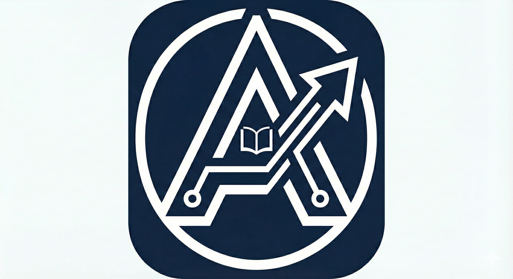

<p align="center">
  
</p>

<h1 align="center">AccessEdu</h1>

<p align="center">
  AI-powered accessibility suite that adapts educational content for students with disabilities.
  <br />
  <a href="https://accessedu.vercel.app">Live Demo</a> · <a href="https://github.com/SaaiAravindhRaja/AccessEdu/issues">Report Bug</a>
</p>

---

## The Problem

1 in 5 students has a learning disability. Most educational content — PDFs, lecture slides, recorded classes — is built for neurotypical learners. Students with dyslexia, ADHD, visual or hearing impairments spend more time fighting the format than learning the material.

## What AccessEdu Does

AccessEdu reformats content on-demand to fit how each student actually processes information.

| Mode | Input | Output |
|------|-------|--------|
| **Vision Aid** | Image or diagram | Detailed AI description for screen readers |
| **Lecture Captioner** | Audio recording | Real-time captions + structured summary |
| **Dyslexia Reader** | Any text | OpenDyslexic font, wider spacing, soft overlays |
| **ADHD Summarizer** | Long text | Bullet-point summary, highlighted key terms, progress tracking |
| **Access Pack Studio** | Single lesson | All four outputs at once |

## Tech Stack

- **Framework** — Next.js 14 (App Router), TypeScript
- **Styling** — Tailwind CSS, shadcn/ui
- **AI** — OpenAI GPT-4o (vision + text)
- **Speech** — Web Speech API (browser-native, no server needed)
- **Font** — OpenDyslexic
- **Deployment** — Vercel

## Getting Started

```bash
git clone https://github.com/SaaiAravindhRaja/AccessEdu.git
cd AccessEdu
npm install
npm run dev
```

Open [http://localhost:3000](http://localhost:3000).

All tools run in **Demo Mode** without any API keys. To enable live AI, add your OpenAI key inside any mode's settings panel.

## Project Structure

```
src/
  app/           # Routes — /, /vision, /caption, /dyslexia, /adhd, /settings
  components/    # Feature components and UI
  lib/           # AI client, speech wrapper, accessibility helpers
public/
  fonts/         # OpenDyslexic
  logo.png
```

## Accessibility

- WCAG 2.1 AAA compliant
- Keyboard-first navigation with visible focus states
- ARIA labels on all interactive elements
- High contrast and reduced motion modes
- Minimum 44px touch targets

## Scripts

```bash
npm run dev      # Development server
npm run build    # Production build
npm run lint     # ESLint
```

